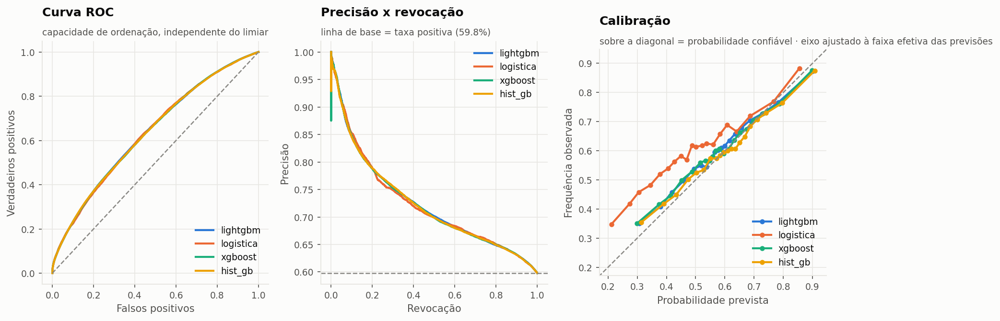
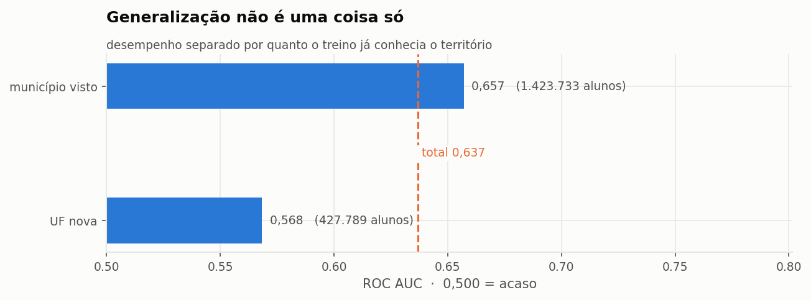
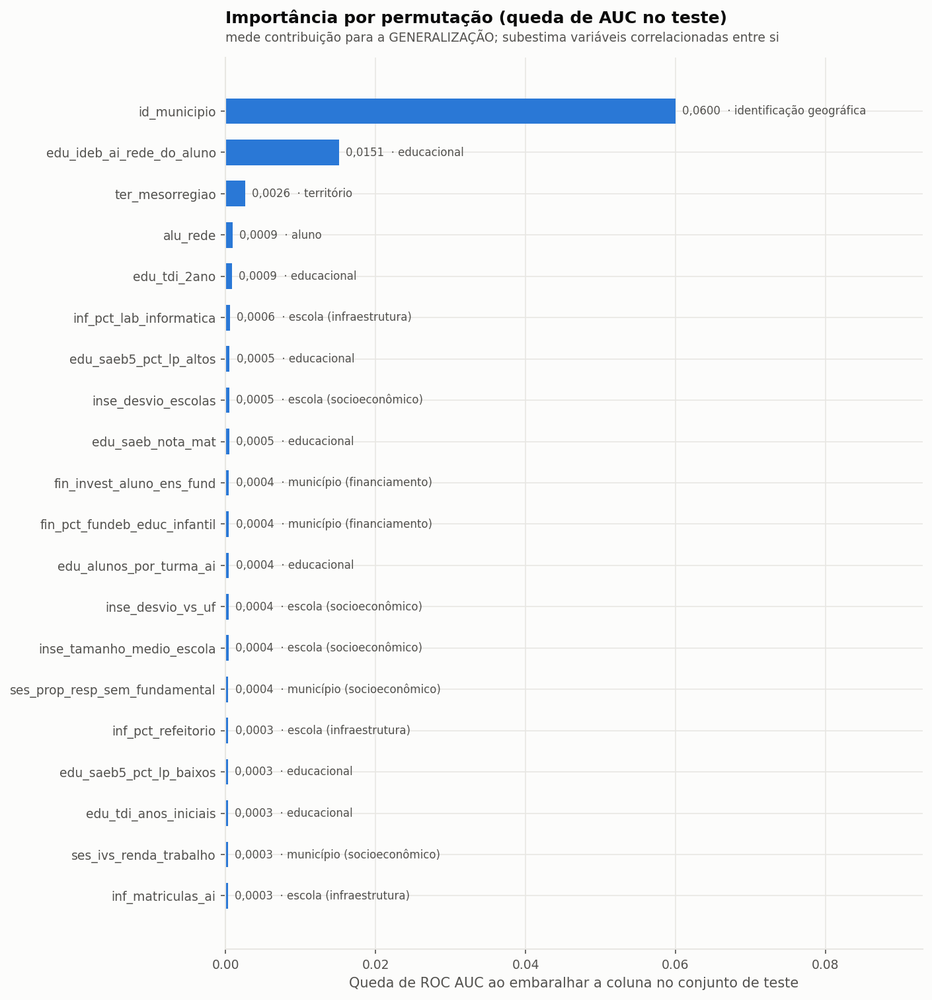
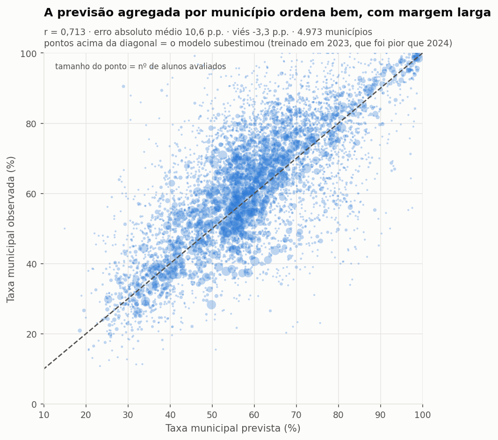
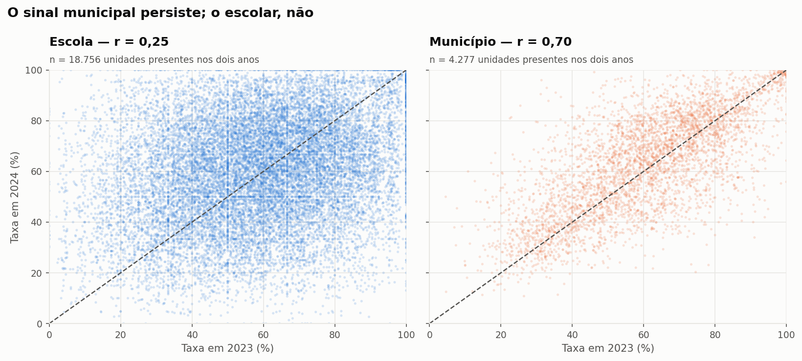
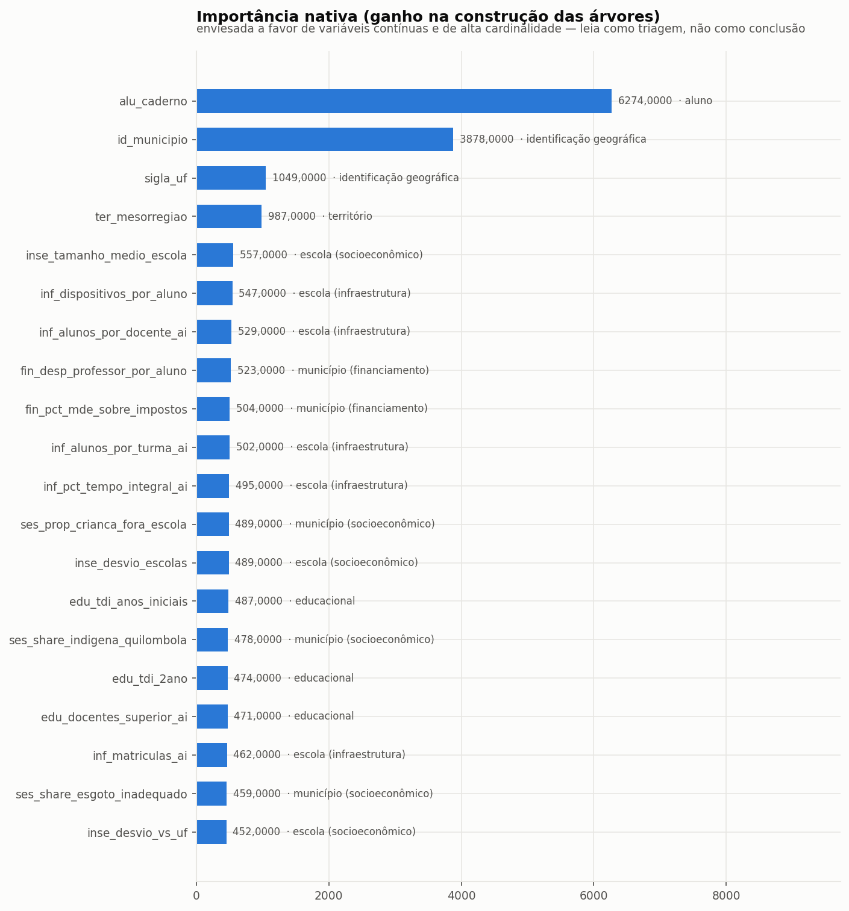
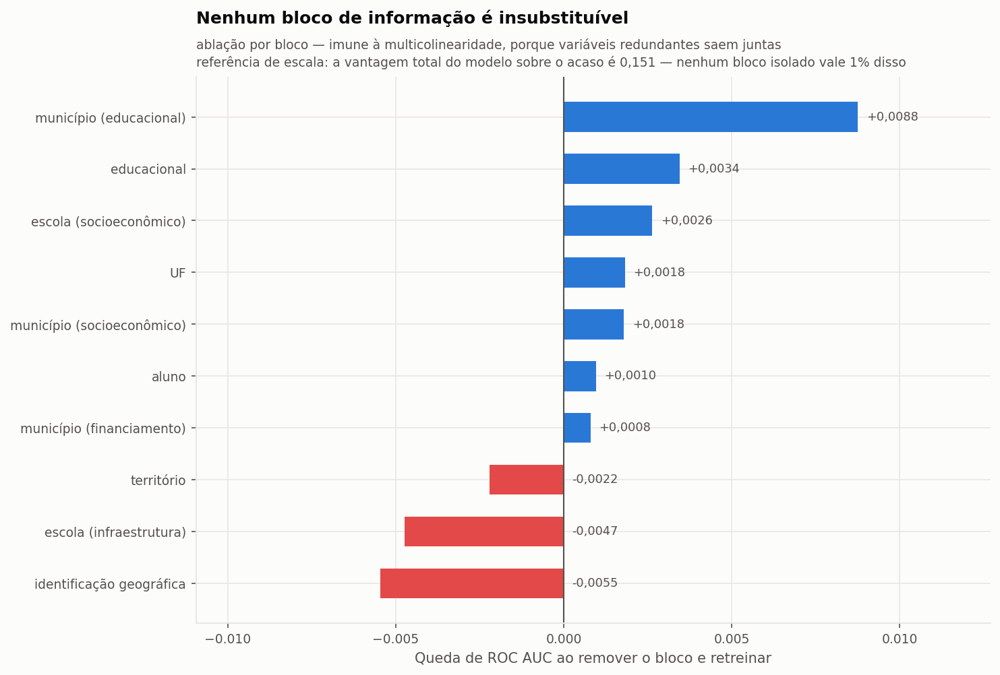
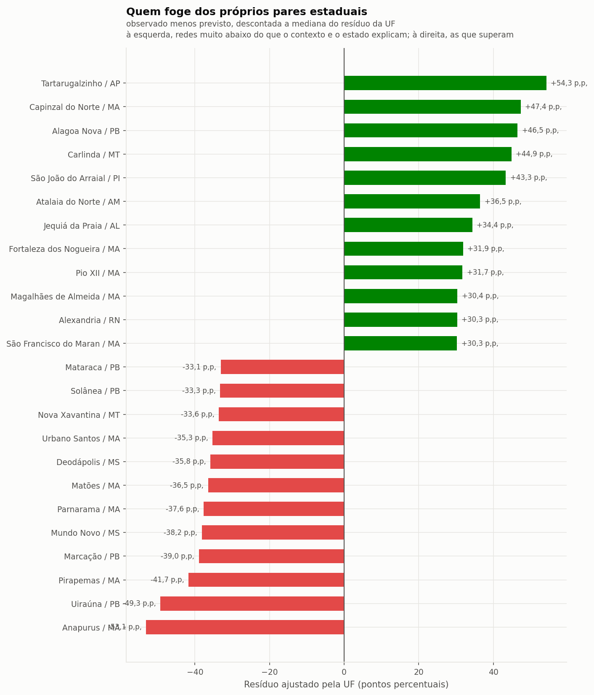

# Predição e Inteligência Analítica para Alfabetização no Brasil

**Tech Challenge — Fase 3 · POSTECH/FIAP · Grupo 48**
Renato Eduardo Bortolotto Netto — RM372714

Modelo supervisionado que prevê se uma criança do 2º ano do ensino fundamental será
considerada alfabetizada, a partir de variáveis educacionais, territoriais e
socioeconômicas — e a tradução desse modelo em inteligência aplicável à política
pública.

Este projeto consome diretamente a camada Gold construída na
[Fase 2](https://github.com/renatobortolotto/fiap-project2).

---

## Sumário

1. [Contexto do problema](#1-contexto-do-problema)
2. [Objetivo analítico](#2-objetivo-analítico)
3. [Base utilizada](#3-base-utilizada)
4. [Etapas de modelagem](#4-etapas-de-modelagem)
5. [Escolha do algoritmo](#5-escolha-do-algoritmo)
6. [Métricas de avaliação](#6-métricas-de-avaliação)
7. [Interpretação dos resultados](#7-interpretação-dos-resultados)
8. [Insights encontrados](#8-insights-encontrados)
9. [Limitações do projeto](#9-limitações-do-projeto)
10. [Aplicação prática para políticas públicas](#10-aplicação-prática-para-políticas-públicas)
11. [Possíveis evoluções futuras](#11-possíveis-evoluções-futuras)
12. [Como reproduzir](#12-como-reproduzir)

---

## 1. Contexto do problema

O Compromisso Nacional Criança Alfabetizada estabeleceu que toda criança brasileira
deve estar alfabetizada ao fim do 2º ano do ensino fundamental, com meta nacional de
**80% até 2030**. O Indicador Criança Alfabetizada, produzido pelo INEP, mede o
avanço: uma criança é considerada alfabetizada quando atinge **743 pontos** na escala
Saeb de leitura.

Em 2024, **59,8%** das crianças avaliadas atingiram esse patamar. A distância até a
meta não está distribuída por igual: entre os 4.973 municípios com ao menos 30 alunos
avaliados, a taxa vai de **10,8% a 100%**. Metade deles está entre 49% e 77% — e 10%
ficam abaixo de 37%.

O problema de gestão não é medir o passado — isso o indicador já faz. É **antecipar**:
identificar, antes do fim do ciclo, onde o risco se concentra, quais fatores o
sustentam e quais redes estão indo pior do que o próprio contexto explicaria. É aí
que a ciência de dados entra.

## 2. Objetivo analítico

**Prever se um aluno será classificado como alfabetizado**, usando apenas informação
disponível *antes* do desfecho.

A formulação é deliberadamente estrita nesse ponto, e boa parte do trabalho foi
garantir que ela se sustentasse. O registro completo, com as medições que sustentam
cada decisão, está em **[`docs/decisoes-analiticas.md`](docs/decisoes-analiticas.md)**.

Três objetivos derivados, que transformam a predição individual em decisão pública:

- **quantificar** quais fatores mais se associam à alfabetização;
- **ordenar** os municípios por risco — e, mais útil, pelo quanto eles se afastam do
  próprio contexto;
- **estimar** a probabilidade de cada município não atingir a meta pactuada.


## 3. Base utilizada

### O grão e a população

Um registro por **aluno avaliado**: 3.354.661 crianças, em 2023 e 2024, distribuídas
por 5.547 municípios — 26 das 27 unidades da federação (Roraima não aparece na base).

A população exclui quem não fez a prova. Não é um filtro de conveniência — é uma
exigência lógica verificada nos dados:

| `presenca` | `preenchimento_caderno` | registros | % alfabetizados |
|---|---|---:|---:|
| FALSE | FALSE | 512.216 | **0,00%** |
| TRUE | FALSE | 1.185 | **0,00%** |
| TRUE | TRUE | 3.355.098 | 59,16% |

Fora da população avaliada o rótulo é determinístico. Mantê-la faria o modelo alcançar
acurácia alta aprendendo "faltou ⇒ não alfabetizado" — uma tautologia administrativa,
não um achado pedagógico.

### As features

**125 features em 8 blocos temáticos** no Modelo A (137 em 10 blocos no Modelo B, que
acrescenta o histórico defasado), todas ligadas ao aluno pelo município e pela rede de
ensino. O detalhamento de fonte, chave e política temporal de cada bloco está em
**[`docs/fontes-de-dados.md`](docs/fontes-de-dados.md)**.

| bloco | nº | origem |
|---|---:|---|
| município (socioeconômico) | 38 | IBGE (Censo 2022, PIB, população), IPEA (IVS), Atlas do Desenvolvimento Humano, CadÚnico, Bolsa Família |
| educacional | 31 | INEP — indicadores educacionais, IDEB, SAEB |
| escola (infraestrutura) | 22 | Censo Escolar |
| município (financiamento) | 14 | FNDE/FUNDEB, SICONFI |
| escola (socioeconômico) | 10 | INSE/INEP |
| território | 6 | diretório de municípios do IBGE |
| aluno | 2 | microdados da avaliação (rede e caderno de prova) |
| identificação geográfica | 2 | município e UF (codificados pelo alvo, fora da dobra) |

Os blocos `escola (…)` merecem um esclarecimento que a próxima seção detalha: **eles
não descrevem a escola do aluno**. As fontes originais têm grão escolar, mas o join
escolar é impossível, então tudo foi agregado à rede do município, ponderado pelas
matrículas.

### A limitação que moldou todo o projeto

**O identificador de escola dos microdados é inutilizável para junção.** Duas
verificações independentes:

1. `id_escola` **não é o código INEP**: dos 42.811 identificadores, **zero** casam com
   `br_inep_censo_escolar.escola`. Ele é uma sequência de `60000001` a `60042811`, com
   prefixo único `"60"`, enquanto códigos INEP reais começam pelo código IBGE da UF.
2. `id_escola` é **renumerado a cada ano**: dos 36.051 identificadores presentes em
   2023 e 2024, apenas **864 (2,4%)** apontam para o mesmo município; 80,6% apenas
   permanecem na mesma UF.

Consequência: nenhuma fonte externa pode ser ligada à escola, e nenhuma feature
longitudinal de escola pode ser construída. O INSE por escola — provavelmente a
variável socioeconômica mais forte disponível no Brasil — foi perdido por isso. Tudo
foi agregado ao grão **(ano, município, rede)**, que casa com 100% dos alunos.

Esta descoberta corrigiu uma conclusão anterior do projeto. A persistência escolar
medida (r = 0,22) havia sido interpretada como "o desempenho das escolas é instável
porque as coortes do 2º ano são pequenas". A interpretação estava errada: o que o
número media era um efeito de UF disfarçado, produzido por unir escolas diferentes sob
o mesmo número. O SQL da hipótese refutada está preservado em
[`docs/descartado/`](docs/descartado/).


## 4. Etapas de modelagem

### 4.1 Tratamento de data leakage

Três vazamentos foram encontrados **medindo**, não presumindo. Dois deles contrariavam
a intuição inicial.

**(a) `proficiencia` é o alvo disfarçado.** O rótulo é *exatamente*
`proficiencia >= 743`. Em 3.355.098 alunos: zero registros alfabetizados com
proficiência abaixo do corte, zero não alfabetizados acima. Não há relação estatística
a aprender — há uma identidade.

**(b) As metas do Compromisso Nacional derivam do resultado de 2023.** A intuição era
que a meta, por ser um compromisso definido *a priori*, seria informação legítima. A
medição desmentiu:

| variável | corr. com a taxa observada de 2023 | corr. com a de 2024 |
|---|---:|---:|
| `meta_alfabetizacao_2024` | **0,968** | 0,675 |
| `nivel_alfabetizacao` | **0,955** | 0,665 |

As metas foram calculadas *a partir* do ano-base de 2023 — são esse resultado
reescalado. As linhas de 2023 e 2024 da tabela trazem metas idênticas (0 divergências
em 5.352 municípios), confirmando que foram pactuadas uma única vez. Reclassificadas
como features **defasadas**: legítimas para 2024, vazamento para 2023.

**(c) Todo contexto de desempenho é defasado em um ano.** A taxa municipal do *mesmo*
ano é a média do alvo dos colegas daquele aluno. A defasagem também reproduz a
realidade operacional: quem planeja 2024 conhece o resultado de 2023.

Além disso, `presenca` e `preenchimento_caderno` foram removidos (determinam a classe
negativa) e `alu_peso_amostral` foi excluído — não por vazamento (correlação de −0,045
e −0,066 com o alvo), mas porque é um artefato do desenho amostral cuja metodologia
mudou entre os anos: 13.185 valores distintos em 2023 contra 540 em 2024.

> **Nota de engenharia.** Remover o peso amostral reduziu o tempo de ajuste da
> regressão logística de **8 minutos para 40 segundos**. A coluna tinha cauda pesada
> (de 0,095 a 142,5) e arruinava o condicionamento numérico do lbfgs. Um problema de
> modelagem e um de desempenho, com a mesma causa.

Uma variável foi mantida **de propósito**, embora não devesse ter poder preditivo:
`alu_caderno`, o número do caderno de prova atribuído por rotação. Ela é um **controle
negativo** — se o pipeline estiver correto, tem de aparecer como irrelevante nas
medidas honestas de importância. O que aconteceu com ela está em §8.7, e é o achado
metodológico mais instrutivo do projeto.

### 4.2 Imputação e transformação, integradas ao modelo

Todo o pré-processamento vive dentro de um `sklearn.Pipeline`. Não é preferência de
estilo: é a **garantia mecânica** contra vazamento. Imputação e encoding são
estimadores com parâmetros aprendidos; aplicados ao dataframe inteiro antes da
partição, a mediana de imputação e as médias do target encoding teriam visto o teste.

| tipo | tratamento | por quê |
|---|---|---|
| numéricas | mediana + **indicador de ausência** | a mediana resiste à assimetria de PIB e população; o indicador importa porque a ausência **não é aleatória** — marca municípios que entraram na avaliação em 2024 |
| categóricas (≤15 níveis) | one-hot, categorias <1% num balde | evita quebra com categorias vistas só no teste |
| alta cardinalidade | `TargetEncoder` com CV interna | município tem ~5,5 mil níveis; a CV interna faz o encoding fora-da-dobra, que é o antídoto para o vazamento clássico da técnica |

Um teste automatizado trava essa garantia: um conjunto sintético em que cada categoria
tem uma única linha — caso em que um encoder ingênuo memorizaria o alvo — deve
produzir AUC próxima de 0,50 em dados novos.

**Uma observação que os resultados tornaram central.** Codificar `id_municipio` pelo
alvo, no Modelo A, equivale a injetar a taxa municipal de 2023 nas linhas de 2024.
Como treino e teste são disjuntos **no tempo**, isso é uma defasagem legítima — e é
justamente por essa via que o Modelo A captura o efeito municipal sem usar as colunas
`mun_lag_*`, que não existem para 2023. Acabou sendo o mecanismo dominante do modelo
(§8.8).

### 4.3 Dois desenhos de validação

Não há 2022 na base: nenhum aluno de 2023 pode ter histórico. Um único modelo com
features defasadas descartaria 45% dos dados e ficaria sem validação temporal. Daí
dois modelos, reportados lado a lado:

| | **Modelo A — temporal** | **Modelo B — espacial** |
|---|---|---|
| treino | 2023 (1.502.809 alunos) | 75% dos municípios de 2024 (1.429.884 alunos) |
| teste | 2024 (1.851.852 alunos) | 25% restante (421.968 alunos) |
| features | 125, em 8 blocos | 137, em 10 blocos |
| histórico t-1 | indisponível | disponível (77% de cobertura) |
| pergunta | *sobrevive à passagem do tempo?* | *vale para municípios nunca vistos?* |
| melhor ROC AUC | **0,6370** | **0,6454** |

A partição espacial agrupa por município: como praticamente toda feature é constante
dentro de um município, uma partição aleatória por aluno colocaria colegas nos dois
lados e o modelo seria premiado por **memorizar a média municipal**.

A validação cruzada usada na otimização é `StratifiedGroupKFold` pela mesma razão — sob
uma CV comum, o hiperparâmetro vencedor seria o que mais memoriza.

### 4.4 O teste out-of-time não é só "um ano depois"

Três unidades da federação aparecem **apenas em 2024**: AC, DF e SP. São 676
municípios novos e **428.119 alunos — 23,1% do conjunto de teste** — sem qualquer
presença no treino. São Paulo sozinho responde por 395.444 deles: o maior estado do
país entra na base exatamente no ano de teste.

Há também deriva real de nível nas UFs presentes nos dois anos: o Rio Grande do Sul
cai 18,9 p.p. (64,7% → 45,8%) e Minas Gerais sobe 11,7 p.p. (60,9% → 72,6%).

**Roraima não aparece em nenhum dos dois anos** — a cobertura é de 26 das 27 UFs e de
5.547 dos 5.570 municípios brasileiros.

Por isso as métricas são reportadas **estratificadas** em três grupos — município
visto, município novo em UF vista, e UF nova. Um número único misturaria
*generalização temporal* com *extrapolação geográfica*, que são capacidades
diferentes.


## 5. Escolha do algoritmo

Cinco candidatos, em três famílias: uma referência trivial (piso), um modelo linear
interpretável (contraprova) e três implementações de *gradient boosting*.

**Modelo A — out-of-time, treino 2023 → teste 2024 (1.851.852 alunos)**

| modelo | ROC AUC | PR AUC | KS | Brier | log loss | acurácia balanceada |
|---|---:|---:|---:|---:|---:|---:|
| **LightGBM** | **0,6370** | 0,7231 | 0,1855 | **0,2268** | 0,6437 | 0,5927 |
| XGBoost | 0,6360 | 0,7225 | 0,1809 | 0,2269 | 0,6439 | 0,5904 |
| HistGradientBoosting | 0,6360 | 0,7225 | 0,1812 | 0,2267 | 0,6438 | 0,5906 |
| Regressão logística | 0,6360 | 0,7222 | **0,1879** | 0,2377 | 0,6671 | **0,5940** |
| Referência (taxa-base) | 0,5000 | 0,5978 | 0,0000 | 0,2406 | 0,6743 | 0,5000 |



**O resultado mais informativo desta tabela é o empate** — e ele foi testado, não
suposto. Bootstrap **pareado** sobre o conjunto de teste (300 reamostras, mesmas
reamostragens nos dois modelos comparados):

| comparação | diferença de ROC AUC | IC 95% | p |
|---|---:|---|---:|
| LightGBM − Regressão logística | +0,0011 | [−0,0002; +0,0022] | 0,087 |
| LightGBM − XGBoost | +0,0007 | [−0,0000; +0,0014] | 0,060 |
| LightGBM − HistGradientBoosting | +0,0010 | [+0,0001; +0,0018] | 0,040 |

**A vantagem do LightGBM sobre uma regressão logística não é estatisticamente
distinguível** (p = 0,087), e nem sobre o XGBoost (p = 0,060). Só a diferença para o
HistGradientBoosting cruza o limiar de 5%, por pouco.

Isso não é coincidência: **o teto é imposto pelos dados, não pelo algoritmo**. Sem nenhum atributo individual da criança (§9), o que resta é contexto
municipal, e contexto municipal é essencialmente aditivo. Trocar de algoritmo não
compra ordenação porque não há interação escondida a descobrir.

O que o boosting compra é **calibração**: o Brier cai de 0,2377 para 0,2268 e o log
loss de 0,667 para 0,644. Para uso em política pública isso importa mais do que
parece — é a diferença entre uma probabilidade que serve para dimensionar um programa
de reforço e uma que apenas ordena.

**LightGBM foi o escolhido** por liderar em ROC AUC e PR AUC, ter o melhor Brier entre
os modelos que também lideram a ordenação, e pela relação custo-benefício: 46 segundos
de treino contra **523 segundos** do HistGradientBoosting para a mesma acurácia — um
fator de 11×. Dado o empate estatístico, a escolha é legítima mas não decisiva: se a
prioridade fosse transparência para um público não técnico, **a regressão logística
seria defensável**, ao custo de calibração pior.

**Nota contra a tentação de complicar.** Diante de um empate assim, a leitura correta
não é "preciso de um modelo maior". É que o ganho está em obter dados melhores, não em
espremer mais o mesmo dado — o que direciona a §11.

## 6. Métricas de avaliação

Cinco métricas, cada uma respondendo a uma pergunta distinta. A escolha de reportar
todas — em vez de uma acurácia — é deliberada: em um problema quase balanceado
(59,8% positivos) a acurácia isolada é fácil de inflar e difícil de interpretar.

| métrica | o que mede | por que importa aqui |
|---|---|---|
| **ROC AUC** | capacidade de ordenação, independente do limiar | métrica de referência para comparar modelos; insensível à taxa-base, que varia entre UFs |
| **PR AUC** | precisão ao longo da revocação, focada na classe positiva | o uso real é priorizar quem precisa de apoio, não classificar todo mundo |
| **Brier e log loss** | **calibração** | se o modelo aponta 30% de risco para mil crianças, cerca de 300 precisam de fato não se alfabetizar; sem isso, o programa de apoio é mal dimensionado |
| **KS** | separação máxima entre as acumuladas das classes | leitura consagrada em modelos de risco |
| **MCC e acurácia balanceada** | resumo de classificação robusto a desbalanceamento | evitam o falso conforto da acurácia bruta |

O limiar de decisão **não é 0,5**: é o que maximiza o índice de Youden. O corte fixo
em 0,5 só seria ótimo se as classes fossem simétricas em frequência *e* em custo — e
deixar de identificar uma criança em risco custa muito mais que um alerta falso.

Toda métrica principal vem com **intervalo de confiança por bootstrap**, e a comparação
entre modelos usa **bootstrap pareado** — as mesmas reamostragens nos dois modelos,
o que remove a variância comum e é bem mais sensível que comparar dois intervalos
independentes.


## 7. Interpretação dos resultados

### 7.1 Generalizar no tempo e extrapolar no espaço são coisas diferentes

A métrica agregada esconde o resultado mais importante do projeto. Separando o
conjunto de teste de 2024 por quanto o treino já conhecia o território:

| estrato | alunos | taxa-base | ROC AUC | Brier |
|---|---:|---:|---:|---:|
| **município já visto em 2023** | 1.423.733 | 59,8% | **0,6571** | 0,2230 |
| **UF nova (AC, DF, SP)** | 427.789 | 58,5% | **0,5683** | 0,2398 |
| total | 1.851.852 | 59,8% | 0,6370 | 0,2268 |



**O modelo perde cerca de dois terços da sua vantagem sobre o acaso quando encara um
estado que nunca viu.** De 0,657 para 0,568, sendo 0,500 o acaso puro: a margem cai de
0,157 para 0,068.

A leitura honesta disso é que boa parte da habilidade aparente do modelo é
**conhecimento de municípios específicos**, aprendido pelo *target encoding* de
`id_municipio` sobre os dados de 2023 — uma defasagem legítima, mas que não se
transfere para territórios ausentes do treino. O que generaliza de verdade para um
estado novo é o bloco socioeconômico e demográfico, e ele sozinho explica bem menos.

Nenhum relatório que reportasse apenas "AUC 0,637" permitiria essa conclusão. Foi
preciso estratificar, e foi preciso descobrir antes que AC, DF e SP entram só em 2024.

### 7.2 O que o modelo usa

**No plano das correlações** (grão do município), as associações mais fortes são o
desempenho municipal do ano anterior (r ≈ 0,68), o contexto da UF (r ≈ 0,57) e os
indicadores de aprendizagem defasados — IDEB e SAEB do 5º ano (r ≈ 0,55). Depois vêm o
nível socioeconômico das escolas e o bloco demográfico.

**No plano do modelo**, porém, a concentração é muito maior do que essas correlações
sugerem. Medida por permutação no conjunto de teste — a métrica que mede contribuição
para a generalização, e não para o ajuste:

| variável | queda de ROC AUC ao embaralhar |
|---|---:|
| `id_municipio` (codificado pelo alvo de 2023) | **0,0600** |
| `edu_ideb_ai_rede_do_aluno` (IDEB defasado) | 0,0151 |
| `ter_mesorregiao` | 0,0026 |
| *cada uma das outras 122 variáveis* | < 0,001 |

As 21 variáveis socioeconômicas municipais somadas contribuem 0,0025 — vinte e quatro
vezes menos que a identidade do município sozinha.

Essa leitura, porém, é só metade da história: a **ablação** mostra que remover
`id_municipio` e retreinar custa apenas 0,0010, porque as demais features reconstroem o
mesmo sinal. As duas medidas juntas revelam algo mais interessante que qualquer uma
isolada — §8.8.



A infraestrutura escolar aparece, mas **abaixo** do contexto social. Entre as
variáveis demográficas, a hierarquia medida contraria a intuição comum: idade mediana
(+0,32), proporção de crianças de 5 a 9 anos (−0,31) e índice de envelhecimento
(+0,31) pesam de **duas a cinco vezes mais** que saneamento (0,06 a 0,09) ou PIB per
capita (0,11). O sinal é de **pressão demográfica sobre a rede** — muitas crianças por
adulto —, não de riqueza.

### 7.3 Um alerta contra ler associação como alavanca

A variável "percentual de docentes dos anos iniciais com curso superior" correlaciona
**−0,45** com a taxa municipal de alfabetização. Municípios com professores mais
titulados alfabetizam *menos*.

A explicação óbvia seria confundimento regional. Ela não se sustenta: a correlação
permanece negativa **dentro de cada região** (de −0,42 no Sul a −0,12 no Sudeste) e
sobrevive ao controle estatístico por vulnerabilidade social (−0,38) e por nível
socioeconômico das escolas (−0,39).

Parte do mecanismo é visível: a titulação docente correlaciona **+0,52 com o IVS** —
municípios mais vulneráveis têm professores *mais* titulados. Mas controlar por isso
apenas atenua a associação, não a elimina. **Com estes dados, o mecanismo não é
identificável.** Pode ser direcionamento reverso de política (programas de titulação
concentrados onde o resultado é pior), pode ser característica do próprio indicador,
podem ser confundidores não observados.

O valor deste achado não é a resposta — é a demonstração de por que **nenhuma variável
deste modelo deve ser lida como alavanca de política**. O modelo ordena risco; ele não
mede efeito causal.


### 7.4 A precisão que interessa ao gestor é a agregada

A predição individual tem teto baixo — e isso é estrutural, não uma falha do modelo
(§9). Mas o erro individual em boa parte **se cancela na média**, e é a média municipal
que orienta a política pública.

Agregando as probabilidades previstas por município, no conjunto de teste de 2024:

| métrica da previsão agregada | valor |
|---|---:|
| municípios avaliados (≥30 alunos) | 4.973 |
| correlação prevista × observada | **0,713** |
| erro absoluto médio | **10,6 p.p.** |
| erro mediano | 8,3 p.p. |
| viés | **−3,3 p.p.** |
| R² | 0,447 |



**Leitura honesta destes números.** Um erro absoluto médio de 10,6 pontos percentuais
não é pequeno — mas o desvio-padrão das taxas municipais é de cerca de 19 p.p., de modo
que o modelo explica pouco menos da metade da variância entre municípios (R² = 0,447).
É útil para ordenar e para dimensionar com folga; não é útil para afirmar que um
município terá exatamente 62% e não 70%.

O **viés de −3,3 p.p.** — o modelo prevê sistematicamente menos alfabetização do que
ocorreu — tem explicação direta: ele foi treinado em 2023, e 2024 foi um ano melhor
(59,8% contra 58,4%). Um modelo treinado no passado carrega o nível do passado. Em uso
recorrente, isso se corrige com recalibração anual.

### 7.5 O resíduo bruto engana — e o projeto errou nisso primeiro

A primeira versão desta análise ordenou os municípios pelo **resíduo** (observado −
previsto), apresentando-o como a medida de "quem vai pior do que seu contexto
explicaria". A lista resultante tinha um padrão suspeito: **4 dos 10 piores resíduos
eram do Rio Grande do Sul**.

A causa não era gestão municipal. O Rio Grande do Sul inteiro caiu 18,9 p.p. entre 2023
e 2024 (§4.4). O modelo, treinado no RS de 2023, previa alto para todo município
gaúcho — e todos "falharam" juntos. O resíduo bruto estava medindo **deriva estadual**,
não desempenho relativo.

A correção adotada é subtrair a mediana do resíduo da própria UF, produzindo o
**resíduo ajustado**: o desvio do município em relação aos seus pares estaduais.

O efeito é imediato — **nenhum município gaúcho permanece entre os dez piores**. A
lista corrigida se concentra no Maranhão (4), Paraíba (2) e Mato Grosso do Sul (2):
redes que vão mal *em relação aos seus próprios vizinhos de estado*, que é a pergunta
que um gestor consegue acionar. É essa a coluna reportada em
`reports/aplicacao_temporal.md`.

Vale registrar o erro pelo que ele ensina: **a medida aparentemente mais sofisticada —
o resíduo de um modelo — pode embutir um confundidor grosseiro**. Só a inspeção da
lista final, e não a métrica agregada, revelou o problema.


## 8. Insights encontrados

### 8.1 O teto é do dado, não do algoritmo

Quatro modelos de três famílias diferentes — linear, boosting histogramado, boosting
leaf-wise e boosting depth-wise — convergem em ROC AUC entre **0,636 e 0,637**. Uma
faixa de 0,001.

Isso responde à pergunta que normalmente se faz primeiro ("qual algoritmo usar?")
mostrando que ela é secundária. **Sem nenhum atributo individual da criança, o
contexto municipal é essencialmente aditivo, e não há interação escondida para um
modelo mais flexível descobrir.** O caminho para melhorar não passa por um modelo
maior; passa por dados que este projeto não pôde obter (§11).

### 8.2 Generalizar no tempo e extrapolar no espaço são capacidades diferentes

Em municípios já vistos em 2023, o modelo alcança AUC **0,657**. Em estados que nunca
viu — AC, DF e SP, 23% do teste — cai para **0,568**. Sobre o acaso de 0,500, a margem
encolhe de 0,157 para 0,068: **dois terços da habilidade aparente desaparecem.**

Boa parte do desempenho, portanto, é *reconhecer municípios*, não *entender
alfabetização*. Um relatório que apresentasse só o número agregado de 0,637 não
permitiria essa distinção — e ela é decisiva para quem quer aplicar o modelo a uma
rede ainda não avaliada.

### 8.3 O município é a única unidade com memória

A taxa municipal de alfabetização de um ano prevê a do ano seguinte com **r = 0,81**
(municípios com ≥200 alunos avaliados). Isso significa que o risco educacional é
estrutural e pode ser antecipado com um ano inteiro de antecedência.

Já a escola é **inalcançável**, por duas limitações independentes da fonte: o
identificador não é o código INEP (0 de 42.811 casam) e é renumerado a cada ano (só
2,4% dos identificadores presentes nos dois anos apontam para o mesmo município). Não
há como ligar dados externos à escola nem construir qualquer feature longitudinal
escolar.



Esse achado corrigiu uma conclusão anterior do próprio projeto: a "baixa persistência
escolar" que se havia medido não era instabilidade pedagógica — era o artefato de
juntar escolas diferentes sob o mesmo número.

### 8.4 As metas oficiais são o resultado passado reescalado

A meta municipal de 2024 do Compromisso Nacional correlaciona **0,968** com a taxa
efetivamente observada em 2023, e o `nivel_alfabetizacao` atribuído pelo MEC
correlaciona 0,955. As metas foram derivadas do ano-base, e as linhas de 2023 e 2024
trazem valores idênticos (0 divergências em 5.352 municípios).

Consequência prática que vai além deste projeto: **"o município cumpriu a meta?" é uma
pergunta quase equivalente a "o município melhorou em relação a si mesmo?"**, e não a
uma referência externa de qualidade.

Isso tem um efeito visível e verificável. Na projeção de quem ficará abaixo da meta,
**as 15 maiores lacunas se concentram no Rio Grande do Sul** — não porque a gestão
gaúcha tenha piorado em relação aos seus pares, mas porque as metas foram calibradas no
patamar alto de 2023 (64,7%) e o estado recuou para 45,8% em 2024. A meta ficou
ancorada num desempenho que a rede deixou de sustentar.

Para um gestor, as duas leituras precisam ser separadas: **a lacuna até a meta** mede
distância de um compromisso pactuado no passado; **o resíduo ajustado** (§7.5) mede
desempenho relativo aos pares. Confundi-las leva a cobrar de uma rede algo que o
indicador não está dizendo.

### 8.5 Pressão demográfica pesa mais que riqueza ou saneamento

Deixando de lado o histórico defasado e os indicadores de aprendizagem (que são o
próprio fenômeno medido antes), as correlações municipais mais fortes são
**demográficas e de vulnerabilidade** — e a riqueza fica bem atrás.

| variável | r com a taxa municipal |
|---|---:|
| razão Bolsa Família / Cadastro Único | **−0,336** |
| índice de vulnerabilidade social (IVS) | −0,312 |
| INSE médio das escolas | +0,310 |
| idade mediana da população | **+0,291** |
| índice de envelhecimento | +0,273 |
| % da população de 5 a 9 anos | **−0,271** |
| alfabetização de adultos de 25 a 44 anos | +0,248 |
| moradores por domicílio | −0,231 |
| % com esgotamento inadequado | −0,109 |
| **PIB per capita** | **+0,090** |

*(n = 9.437 pares município-ano; fonte: `reports/correlacoes_municipais.csv`)*

**O PIB per capita é a variável mais fraca da lista** — três vezes menos associado que a
demografia. Municípios ricos não alfabetizam melhor por serem ricos.

A leitura demográfica não é que idosos alfabetizem crianças. É que **municípios com
muitas crianças por adulto têm redes sob pressão**: mais alunos por turma, mais
rotatividade, menos atenção individual. É um sinal de capacidade instalada versus
demanda — e ele reaparece de forma independente na tipologia de municípios (§10), onde
o grupo de pior desempenho é exatamente o de maior proporção de crianças de 5 a 9 anos.

### 8.6 Associação não é alavanca — o caso da titulação docente

O percentual de docentes dos anos iniciais com curso superior correlaciona **−0,475**
com a alfabetização municipal (n = 9.426 pares município-ano). Mais titulação, menos
alfabetização.

A explicação fácil — confundimento regional — não se sustenta. Restringindo a 2024
para permitir os controles (n = 4.973 municípios, r bruto = −0,452), a correlação
permanece negativa **dentro de cada região** (de −0,42 no Sul a −0,12 no Sudeste) e
sobrevive ao controle estatístico por vulnerabilidade social (−0,377) e por nível
socioeconômico das escolas (−0,387). Parte do mecanismo aparece na estrutura: a
titulação docente correlaciona **+0,52 com o IVS** — municípios mais vulneráveis têm
professores mais titulados.

**Com estes dados o mecanismo não é identificável**, e é exatamente esse o ponto. Um
gestor que lesse a tabela de importâncias como cardápio de políticas concluiria algo
absurdo. O modelo ordena risco; ele não mede efeito causal.

### 8.7 A importância nativa mente — e aqui a prova é medível

A variável de maior importância por ganho no modelo é `alu_caderno`: **o número do
caderno de prova que a criança recebeu**, atribuído por rotação. Seu ganho acumulado
(6.274) supera o de `id_municipio` (3.878).



É ruído. Em 2023, os 21 cadernos diferem apenas **2,7 pontos percentuais** entre o
extremo mais alto e o mais baixo (desvio de 0,67 p.p.). O modelo lhe atribui
importância alta porque a métrica de ganho é enviesada a favor de variáveis de **alta
cardinalidade**: muitos níveis oferecem muitos pontos de corte, e cada corte captura um
pouco de ruído.

Manter `alu_caderno` no conjunto foi deliberado, justamente como **controle negativo**.
A importância por permutação, medida no conjunto de teste, desfez a ilusão de forma
inequívoca:

| variável | importância nativa (ganho) | posição | permutação (queda de AUC) | posição |
|---|---:|---:|---:|---:|
| `alu_caderno` | 6.274 | **1ª de 125** | **−0,00054** | **124ª de 125** |
| `id_municipio` | 3.878 | 2ª | **+0,0600** | **1ª** |

A variável mais importante pela métrica de ganho é a penúltima pela métrica que mede
generalização — e sua "contribuição" é até levemente **negativa**, isto é, embaralhá-la
melhora o modelo. É o argumento mais direto possível contra ler importância nativa
como conclusão.

### 8.8 Existe um só sinal — o município — escrito de 125 maneiras

Duas medidas de importância discordam frontalmente, e a discordância é o achado.

**A permutação** diz que o modelo se apoia quase inteiramente na identidade do
município:

| variável | queda de ROC AUC ao embaralhar |
|---|---:|
| `id_municipio` (codificado pelo alvo de 2023) | **0,0600** |
| `edu_ideb_ai_rede_do_aluno` (IDEB defasado) | 0,0151 |
| `ter_mesorregiao` | 0,0026 |
| *cada uma das outras 122 variáveis* | < 0,001 |

**A ablação** diz que nada disso é insubstituível. Removendo cada bloco temático
inteiro e **retreinando**:

| bloco removido | features restantes | ROC AUC | queda |
|---|---:|---:|---:|
| município (socioeconômico) | 87 | 0,6322 | **+0,0015** |
| educacional | 94 | 0,6325 | +0,0013 |
| escola (socioeconômico) | 115 | 0,6326 | +0,0012 |
| identificação geográfica | 123 | 0,6327 | +0,0010 |
| escola (infraestrutura) | 103 | 0,6336 | +0,0002 |
| *(modelo completo)* | 125 | 0,6338 | — |
| território | 119 | 0,6339 | −0,0001 |
| aluno | 123 | 0,6341 | −0,0003 |
| município (financiamento) | 111 | 0,6341 | −0,0004 |

Remover `id_municipio` e `sigla_uf` — as variáveis que a permutação aponta como
dominantes — custa **0,0010**. Nenhum bloco, de nenhum tamanho, vale mais que 0,0015.

**Não há contradição: as duas métricas respondem a perguntas diferentes.** A permutação
pergunta *"em que este modelo ajustado se apoia?"*; a ablação pergunta *"que
informação é insubstituível?"*. A resposta conjunta é que **existe essencialmente um
único sinal nos dados — de que município a criança vem — e ele está codificado
redundantemente em todas as 125 colunas**. O target encoding de `id_municipio` é
apenas a forma mais limpa e comprimida de acessá-lo; tirada essa via, o modelo
reconstrói quase tudo pelo perfil socioeconômico, pelos indicadores educacionais e
pela rede escolar do mesmo município.

Isso amarra os outros achados: explica por que **todos os algoritmos empatam** (§8.1) —
não há estrutura fina a descobrir num sinal único — e por que o modelo **desaba em
estados novos** (§8.2), onde esse sinal precisa ser inferido de contexto sob um regime
regional diferente.



> **Nota metodológica.** A ablação foi rodada sobre uma subamostra de 400 mil alunos de
> treino (11 reajustes do modelo), daí o modelo completo marcar 0,6338 em vez dos
> 0,6370 obtidos com o treino inteiro. As *diferenças* entre blocos, que é o que
> interessa, são comparáveis entre si.


## 9. Limitações do projeto

**O modelo não transfere para territórios que não viu.** É a limitação de uso mais
consequente, e está medida: a AUC cai de 0,657 em municípios conhecidos para 0,568 em
estados novos (§7.1), e a importância por permutação mostra que `id_municipio` sozinho
vale vinte e quatro vezes mais que todas as 21 variáveis socioeconômicas somadas
(§8.8). Na prática, **o modelo é em boa medida uma tabela consultável da taxa municipal
de 2023**, e não um mecanismo que explique alfabetização. Isso o torna útil onde há
histórico e fraco onde não há — que é justamente onde um gestor mais precisaria dele.

**As features de escola são, na verdade, features de município.** O identificador de
escola é anônimo e renumerado anualmente (§3). Toda a variação *entre escolas de um
mesmo município* — que é grande — fica fora do modelo. É a limitação de **dados** mais
séria, e ela vem da fonte, não de uma escolha do projeto. O INSE por escola, provavelmente a
variável socioeconômica mais forte disponível no país, foi perdido por isso.

**Série histórica de dois anos.** Só existem 2023 e 2024. O único par defasagem→alvo
possível é 2023→2024, o que restringe o Modelo B a um único ano e impede qualquer
feature de tendência (dois pontos não definem trajetória).

**Nenhum atributo individual da criança.** Os microdados não trazem sexo, raça/cor,
idade, escolaridade dos pais ou renda familiar. Tudo o que o modelo sabe sobre a
criança é o município, a rede e o caderno de prova que ela recebeu. Isso, e não a
escolha do algoritmo, é o que limita o teto da predição individual.

**Correlações ecológicas.** As associações reportadas foram medidas no grão do
município. A [falácia ecológica](https://pt.wikipedia.org/wiki/Falácia_ecológica)
proíbe lê-las como efeito individual: que municípios com mais idosos alfabetizem mais
não diz nada sobre o filho de uma família específica.

**Associação não é causa.** Nenhuma variável aqui foi manipulada
experimentalmente. "Escolas com biblioteca alfabetizam mais" não autoriza concluir que
construir bibliotecas alfabetiza — municípios que constroem bibliotecas diferem de
muitas outras formas.

**Defasagens longas em parte das fontes.** O IVS e o Atlas do Desenvolvimento Humano
são do Censo 2010; o Cadastro Único, de 2020. Descrevem estrutura persistente, não
conjuntura.

**Independência condicional é otimista.** A probabilidade de um município não atingir a
meta supõe alunos condicionalmente independentes. Colegas de escola compartilham
choques não observados, então o erro-padrão real é maior e as probabilidades saem mais
extremas do que deveriam. O efeito é visível: em municípios grandes a probabilidade
**satura em 100%**, empatando dezenas de cidades e tornando a própria métrica inútil
para ordenar. Por isso o relatório ordena pela **lacuna em pontos percentuais**, que
não satura.

**O alvo é um corte.** 743 pontos é uma fronteira administrativa numa escala contínua.
Uma criança com 742 e outra com 744 são praticamente idênticas em leitura, mas caem em
classes opostas — e a proporção de casos próximos ao corte limita qualquer
classificador.

## 10. Aplicação prática para políticas públicas

**Priorizar pelo resíduo ajustado, não pelo risco absoluto.** Um ranking de risco bruto
lista municípios pobres — informação que o gestor já tem, e que confunde o efeito da
pobreza com o da gestão. O **resíduo ajustado pela UF** (observado − previsto, menos a
mediana do resíduo do estado) isola o que nem o contexto nem a conjuntura estadual
explicam. Muito negativo aponta um problema de gestão, que é acionável; muito positivo
aponta rede que supera as próprias condições — prática a ser estudada e replicada.

O ajuste pela UF não é detalhe: sem ele, a lista se enche de municípios de um estado que
simplesmente teve um ano ruim (§7.5). O modelo serve, aqui, como o controle estatístico
que uma comparação bruta não tem.



**Dimensionar programas, com a margem explícita.** A probabilidade prevista é
razoavelmente calibrada (Brier 0,227 contra 0,241 da taxa-base), então ela pode
dimensionar: se o modelo indica 2.000 crianças com 35% de risco num município,
espera-se cerca de 700 sem alfabetizar. Mas o dimensionamento precisa carregar a margem
medida — **erro absoluto médio de 10,6 p.p. na taxa municipal e viés de −3,3 p.p.**
(§7.4). Na prática: planeje pela faixa, não pelo ponto, e recalibre a cada nova onda de
avaliação.

**Antecipar o descumprimento de metas.** A probabilidade de cada município ficar abaixo
da meta pactuada permite agir no meio do ciclo, e não diante do resultado consumado.

**Identificar pares comparáveis.** O agrupamento por contexto — com o alvo
deliberadamente fora, de modo que a taxa de cada grupo seja resultado e não critério —
produziu cinco perfis com gradiente limpo de desempenho:

| grupo | municípios | % alfabetizados | o que caracteriza (↑ acima, ↓ abaixo da média dos grupos) |
|---|---:|---:|---|
| 1 | 622 | **52,6%** | ↑ crianças de 5-9 anos · ↓ internet pedagógica · ↑ docentes com superior · ↓ idade mediana |
| 2 | 1.138 | 57,9% | ↑ cobertura do Bolsa Família · ↓ renda per capita · ↓ INSE · ↓ alfabetização de adultos |
| 3 | 763 | 60,5% | ↑ distorção idade-série · ↑ alunos por turma · ↑ internet pedagógica · ↑ alfabetização de adultos |
| 4 | 1.370 | 67,6% | ↑ IDHM educação · ↑ renda per capita · ↑ INSE · ↓ Bolsa Família |
| 5 | 1.080 | **69,9%** | ↑ investimento por aluno · ↓ distorção idade-série · ↓ alunos por turma · ↑ idade mediana |

A tipologia é legível como política: o **grupo 1** é pressão demográfica sem
infraestrutura (muitas crianças por adulto, pouca conectividade); o **2** é pobreza
estrutural; o **3** é gargalo de fluxo escolar (distorção e turmas grandes, apesar de
condições razoáveis); o **5** é rede bem financiada com folga demográfica.

Comparar municípios *dentro* de um mesmo grupo é muito mais justo que comparar com a
média nacional, e transforma o resíduo numa lista concreta de "quem, com as mesmas
condições, consegue mais".

> Note que o grupo de pior desempenho é também o de **maior** titulação docente — a
> mesma associação contraintuitiva de §8.6, aparecendo agora por outro caminho.

**O que este modelo não deve fazer.** Não deve ser usado para classificar crianças
individualmente. A acurácia individual é modesta por razões estruturais, e rotular uma
criança como "provável não alfabetizada" com base no município em que nasceu produz
estigma sem ganho de informação. O uso legítimo é **territorial e agregado**.

## 11. Possíveis evoluções futuras

Os resultados desta fase apontam uma direção clara, e ela não é "um modelo melhor".
Quatro algoritmos empatam (§8.1) e nenhum bloco de features é insubstituível (§8.8):
**o que limita o projeto é a ausência de variação observável dentro do município**.
As evoluções abaixo estão ordenadas por esse critério.

**Recuperar o grão da escola.** É a evolução de maior impacto, e não depende de
técnica: depende de obter do INEP a chave de correspondência entre o identificador
anônimo e o código do Censo Escolar. Com ela, entram INSE por escola, infraestrutura
real e efeito de escola — hoje todos invisíveis. É a única mudança capaz de romper o
teto medido, porque é a única que acrescenta informação que ainda não está nas 125
colunas atuais.

**Recalibrar a cada onda.** O viés medido de −3,3 p.p. (§7.4) é consequência direta de
treinar no passado: 2024 foi melhor que 2023. Em uso recorrente, uma recalibração
anual sobre a onda mais recente corrige o nível sem retreinar o modelo inteiro.

**Modelo hierárquico (multinível).** A estrutura aluno ⊂ escola ⊂ município é
naturalmente hierárquica. Um modelo de efeitos mistos estimaria a variância em cada
nível e daria intervalos honestos para o resíduo municipal, em vez do erro-padrão
binomial usado aqui.

**Regressão sobre a proficiência.** Modelar a nota contínua e só depois aplicar o corte
usa muito mais informação que a classificação binária, sobretudo perto da fronteira de
743 pontos.

**Acrescentar anos.** Com 2025 e 2026, features de tendência municipal passam a ser
possíveis, e o Modelo B ganha validação out-of-time própria.

**Quantificar a incerteza da predição.** Conformal prediction daria intervalos com
cobertura garantida para a taxa municipal prevista, o que é mais útil ao gestor do que
um ponto.

**Calibração por região.** Verificar se a calibração se mantém em cada UF: um modelo
calibrado no agregado pode estar sistematicamente otimista no Norte e pessimista no Sul.

**Monitoramento de deriva.** A queda de 18,9 p.p. do Rio Grande do Sul entre 2023 e
2024 mostra que o fenômeno se move. Um modelo em produção precisaria de monitoramento
de deriva e reajuste periódico.

## 12. Como reproduzir

```bash
git clone <repo> && cd tech-challenge-fase3
make setup                                          # venv + dependências

# O ADC local desta máquina pertence a outra conta; use o token de curta duração:
export GCP_ACCESS_TOKEN=$(gcloud auth print-access-token)

make features-dry    # valida os 11 SQLs e estima o custo (~1,5 GiB estimáveis)
make features        # materializa as 11 tabelas de features.*
make dados           # exporta a ABT para data/processed/abt_aluno.parquet
make eda             # análise exploratória -> images/ e reports/eda.md
make modelo-a        # out-of-time (2023 -> 2024)
make modelo-b        # espacial (2024, partição por município)
make figuras         # redesenha as curvas e o painel por estrato, sem retreinar
make comparar        # bootstrap pareado entre os modelos
make tunar           # busca de hiperparâmetros com Optuna, sob CV agrupada
make interpretar     # importâncias, SHAP e ablação por bloco
make aplicacao       # risco municipal, agrupamentos e risco de meta
make notebooks       # regenera os notebooks a partir de src/
make testes          # 13 testes, incluindo os de antivazamento
```

Ou simplesmente `make tudo`. A semente (`random_state = 42`) está centralizada em
`config/config.yaml` e propagada a todo estimador, partição e bootstrap.

### Estrutura

```
tech-challenge-fase3/
├── data/            raw · interim · processed   (reproduzíveis; fora do Git)
├── notebooks/       gerados por `make notebooks` a partir de src/
├── src/
│   ├── common/          configuração, BigQuery, logging
│   ├── preprocessing/   features, pipeline sklearn, feature store
│   ├── modeling/        dataset, candidatos, treino, Optuna
│   ├── evaluation/      métricas, interpretabilidade, aplicação
│   └── visualization/   estilo, EDA, gráficos
├── sql/features/    as 11 tabelas da feature store, documentadas
│                    (o número 03 está ausente de propósito: era o histórico
│                     escolar, hipótese refutada e preservada em docs/descartado/)
├── reports/         métricas, relatórios e rankings gerados
├── images/          figuras
├── docs/            decisões analíticas, fontes de dados, arquitetura
└── tests/           testes de antivazamento e de partição
```

### Documentação complementar

| documento | conteúdo |
|---|---|
| [`docs/decisoes-analiticas.md`](docs/decisoes-analiticas.md) | cada decisão de dados com a medição que a sustenta |
| [`docs/fontes-de-dados.md`](docs/fontes-de-dados.md) | fontes, chaves, política temporal e cobertura |
| [`docs/arquitetura.md`](docs/arquitetura.md) | fluxo BigQuery → Parquet → modelo |
| [`docs/descartado/`](docs/descartado/) | hipóteses testadas e refutadas |
