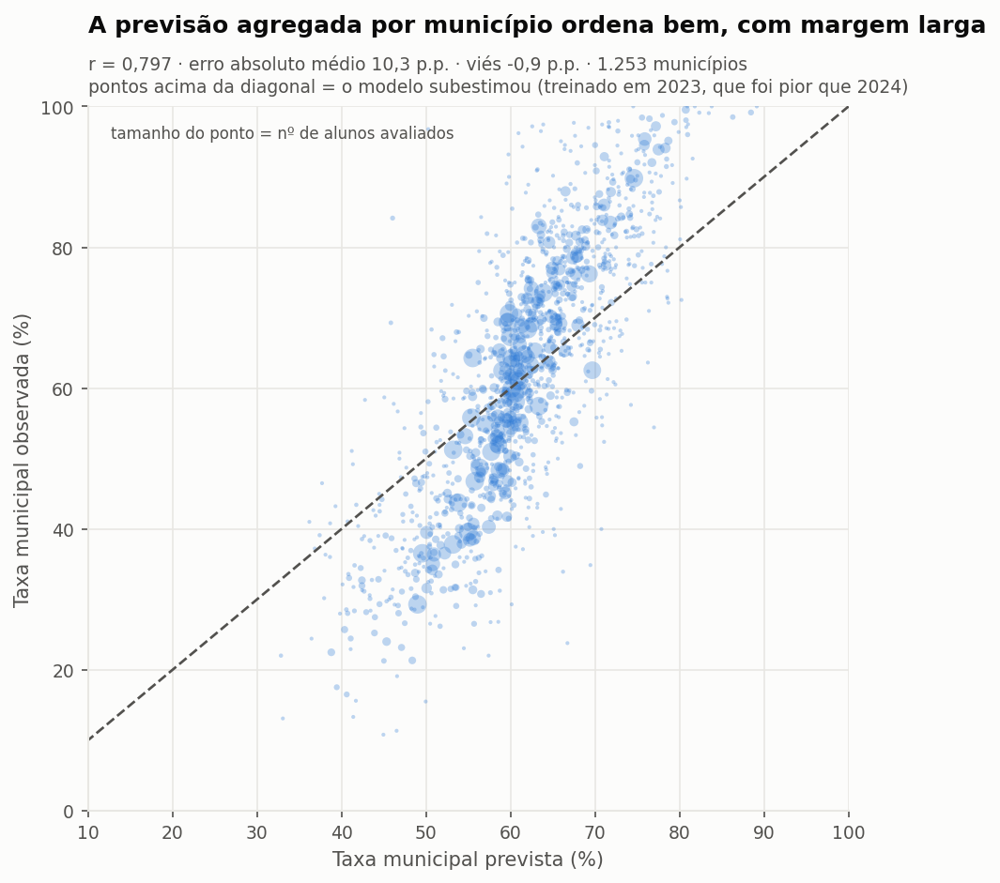
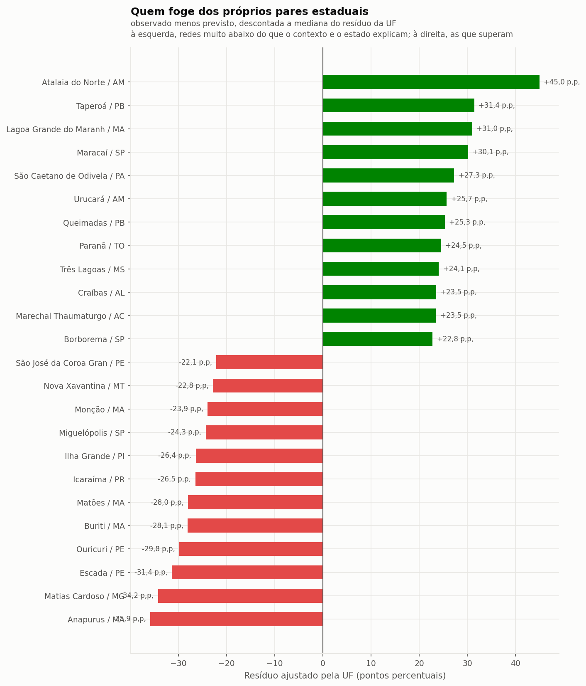

# Aplicação estratégica — desenho `espacial`

## Por que agregar por município muda tudo

A predição individual de alfabetização tem teto baixo: o desfecho de uma criança depende de fatores que nenhum dado público municipal captura. Mas o erro individual em grande parte se **cancela na média** — e é a média municipal que orienta a decisão pública.

| métrica da previsão agregada por município | valor |
|---|---:|
| municípios avaliados (≥30 alunos) | 1.253 |
| correlação prevista × observada | **0,797** |
| erro absoluto médio | **10,3 p.p.** |
| erro mediano | 9,2 p.p. |
| viés | -0,93 p.p. |
| R² | 0,536 |

## Quais municípios apresentam maior risco educacional

Risco = 1 − taxa prevista. Municípios com ao menos 100 alunos avaliados.

| município | UF | alunos | risco previsto | taxa observada |
|---|---|---:|---:|---:|
| Muquém de São Francisco | BA | 118 | 67,2% | 22,0% |
| Coaraci | BA | 115 | 62,6% | 39,1% |
| Pacatuba | SE | 106 | 62,0% | 30,2% |
| Coronel João Sá | BA | 111 | 61,4% | 36,0% |
| Pilão Arcado | BA | 391 | 61,2% | 22,5% |
| Porto da Folha | SE | 228 | 60,5% | 17,5% |
| Ibititá | BA | 100 | 60,2% | 28,0% |
| São Francisco do Conde | BA | 342 | 59,6% | 25,7% |
| Buerarema | BA | 140 | 59,4% | 28,6% |
| Aporá | BA | 230 | 59,4% | 16,5% |
| Itarantim | BA | 112 | 59,3% | 41,1% |
| Campo Alegre de Lourdes | BA | 189 | 59,3% | 28,0% |
| Aurelino Leal | BA | 122 | 59,2% | 33,6% |
| Cachoeira | BA | 242 | 59,1% | 33,1% |
| Paratinga | BA | 233 | 58,9% | 24,5% |

## Quem foge dos próprios pares — a leitura acionável

O risco absoluto em geral apenas reflete a pobreza do território. O **resíduo** (observado − previsto) isola o que o contexto NÃO explica.

Mas o resíduo bruto tem um defeito, e ele apareceu na primeira versão desta análise: **confunde gestão municipal com deriva do estado inteiro**. Como o Rio Grande do Sul caiu 18,9 p.p. entre 2023 e 2024, municípios gaúchos ocupavam 4 das 10 piores posições — por um motivo que nada tem a ver com as redes municipais. A coluna reportada aqui é o **resíduo ajustado**: o resíduo menos a mediana do resíduo da própria UF. O que sobra é o desvio do município em relação aos seus pares estaduais.

### Abaixo dos pares estaduais

| município | UF | alunos | observado | previsto | resíduo bruto | ajustado |
|---|---|---:|---:|---:|---:|---:|
| Anapurus | MA | 109 | 33,9% | 66,2% | -32,3 p.p. | **-35,9 p.p.** |
| Matias Cardoso | MG | 112 | 31,2% | 58,7% | -27,5 p.p. | **-34,2 p.p.** |
| Escada | PE | 406 | 30,8% | 56,5% | -25,7 p.p. | **-31,4 p.p.** |
| Ouricuri | PE | 510 | 31,4% | 55,6% | -24,2 p.p. | **-29,8 p.p.** |
| Buriti | MA | 251 | 29,1% | 53,6% | -24,5 p.p. | **-28,1 p.p.** |
| Matões | MA | 269 | 34,2% | 58,6% | -24,4 p.p. | **-28,0 p.p.** |
| Icaraíma | PR | 105 | 52,4% | 71,1% | -18,7 p.p. | **-26,5 p.p.** |
| Ilha Grande | PI | 148 | 33,8% | 56,3% | -22,5 p.p. | **-26,4 p.p.** |
| Miguelópolis | SP | 155 | 31,0% | 57,6% | -26,7 p.p. | **-24,3 p.p.** |
| Monção | MA | 245 | 35,9% | 56,3% | -20,3 p.p. | **-23,9 p.p.** |

### Acima dos pares estaduais

| município | UF | alunos | observado | previsto | resíduo bruto | ajustado |
|---|---|---:|---:|---:|---:|---:|
| Atalaia do Norte | AM | 164 | 84,1% | 46,1% | +38,1 p.p. | **+45,0 p.p.** |
| Taperoá | PB | 123 | 91,1% | 63,2% | +27,9 p.p. | **+31,4 p.p.** |
| Lagoa Grande do Maranhão | MA | 106 | 97,2% | 62,6% | +34,6 p.p. | **+31,0 p.p.** |
| Maracaí | SP | 110 | 90,9% | 63,1% | +27,8 p.p. | **+30,1 p.p.** |
| São Caetano de Odivelas | PA | 140 | 69,3% | 45,9% | +23,4 p.p. | **+27,3 p.p.** |
| Urucará | AM | 180 | 75,0% | 56,2% | +18,8 p.p. | **+25,7 p.p.** |
| Queimadas | PB | 561 | 92,9% | 71,1% | +21,8 p.p. | **+25,3 p.p.** |
| Paranã | TO | 120 | 68,3% | 50,7% | +17,7 p.p. | **+24,5 p.p.** |
| Três Lagoas | MS | 1.634 | 83,0% | 63,4% | +19,6 p.p. | **+24,1 p.p.** |
| Craíbas | AL | 206 | 68,0% | 53,6% | +14,3 p.p. | **+23,5 p.p.** |

## Quais regiões possuem padrões semelhantes

Agrupamento em 5 perfis por **contexto** (vulnerabilidade, demografia, INSE, docência, infraestrutura, financiamento). O alvo ficou deliberadamente de fora: assim a taxa de alfabetização de cada grupo é um resultado da análise, não o critério que a produziu.

Cada perfil é descrito pelas variáveis em que mais se afasta da média dos grupos (↑ acima, ↓ abaixo):

| grupo | municípios | % alfabetizados | o que caracteriza |
|---|---:|---:|---|
| 1 | 191 | 51,7% | ↑ ses_share_pop_5a9 · ↓ ses_idade_mediana · ↑ edu_docentes_superior_ai · ↓ inf_pct_internet_aprendizagem |
| 2 | 367 | 58,8% | ↓ ses_log_renda_per_capita · ↓ inse_medio · ↑ ses_taxa_pbf · ↓ ses_taxa_alfab_adultos_25a44 |
| 3 | 1 | 59,6% | ↑ fin_invest_aluno_ens_fund · ↑ inf_pct_internet_aprendizagem · ↓ edu_docentes_superior_ai · ↑ ses_taxa_alfab_adultos_25a44 |
| 4 | 321 | 65,3% | ↑ edu_tdi_anos_iniciais · ↑ ses_idhm_educacao · ↑ ses_log_renda_per_capita · ↓ ses_taxa_pbf |
| 5 | 373 | 69,4% | ↓ inf_alunos_por_turma_ai · ↓ edu_tdi_anos_iniciais · ↑ ses_idade_mediana · ↑ inse_medio |

## Quais municípios podem não atingir a meta

A taxa municipal prevista é a média de indicadores de Bernoulli; sua distribuição amostral é aproximadamente normal, e a probabilidade de ficar abaixo da meta é Φ((meta − previsto) / erro-padrão).

| classificação | municípios |
|---|---:|
| provável cumprimento | 229 |
| atenção | 69 |
| risco alto | 69 |
| risco crítico | 263 |

As 15 maiores lacunas entre a taxa prevista e a meta pactuada (municípios com ≥100 alunos avaliados):

| município | UF | alunos | meta | taxa prevista | lacuna | prob. de não atingir |
|---|---|---:|---:|---:|---:|---:|
| Três Cachoeiras | RS | 114 | 80,0% | 58,9% | **-21,1 p.p.** | 100,0% |
| Constantina | RS | 105 | 80,0% | 59,4% | **-20,6 p.p.** | 100,0% |
| Bom Princípio | RS | 171 | 74,7% | 55,6% | **-19,1 p.p.** | 100,0% |
| Paraibano | MA | 261 | 79,0% | 60,0% | **-19,0 p.p.** | 100,0% |
| Lajeado | RS | 733 | 75,5% | 56,5% | **-19,0 p.p.** | 100,0% |
| Venâncio Aires | RS | 487 | 78,4% | 59,7% | **-18,7 p.p.** | 100,0% |
| Alcântara | MA | 110 | 74,5% | 56,0% | **-18,4 p.p.** | 100,0% |
| Nova Hartz | RS | 244 | 73,3% | 55,4% | **-17,9 p.p.** | 100,0% |
| Lagoa Grande do Maranhão | MA | 106 | 80,0% | 62,6% | **-17,4 p.p.** | 100,0% |
| Santiago | RS | 392 | 73,9% | 56,7% | **-17,2 p.p.** | 100,0% |
| Caxias do Sul | RS | 3.664 | 70,9% | 53,8% | **-17,1 p.p.** | 100,0% |
| Panambi | RS | 513 | 76,0% | 59,5% | **-16,5 p.p.** | 100,0% |
| Solânea | PB | 187 | 78,8% | 62,4% | **-16,3 p.p.** | 100,0% |
| Parnarama | MA | 322 | 80,0% | 63,7% | **-16,3 p.p.** | 100,0% |
| Sapiranga | RS | 826 | 73,9% | 57,6% | **-16,3 p.p.** | 100,0% |

> **Por que RS domina esta lista.** Não é artefato: as metas do Compromisso Nacional foram pactuadas sobre o resultado de 2023 (§ decisões analíticas). Onde o estado recuou entre 2023 e 2024, os municípios ficaram com metas calibradas num patamar que a rede deixou de sustentar — e a lacuna projetada cresce por essa razão, não por piora relativa de gestão. Para a leitura de gestão, use o **resíduo ajustado** da seção anterior.

> **Ressalva estatística.** O cálculo supõe independência condicional entre alunos. Como colegas de escola compartilham choques não observados, o erro-padrão real é maior e estas probabilidades são mais extremas do que deveriam — em municípios grandes elas saturam em 100%, o que torna a própria probabilidade inútil para ordenar. Por isso a tabela é ordenada pela **lacuna em pontos percentuais**, que não satura. A ordenação é confiável; a magnitude da probabilidade, não.