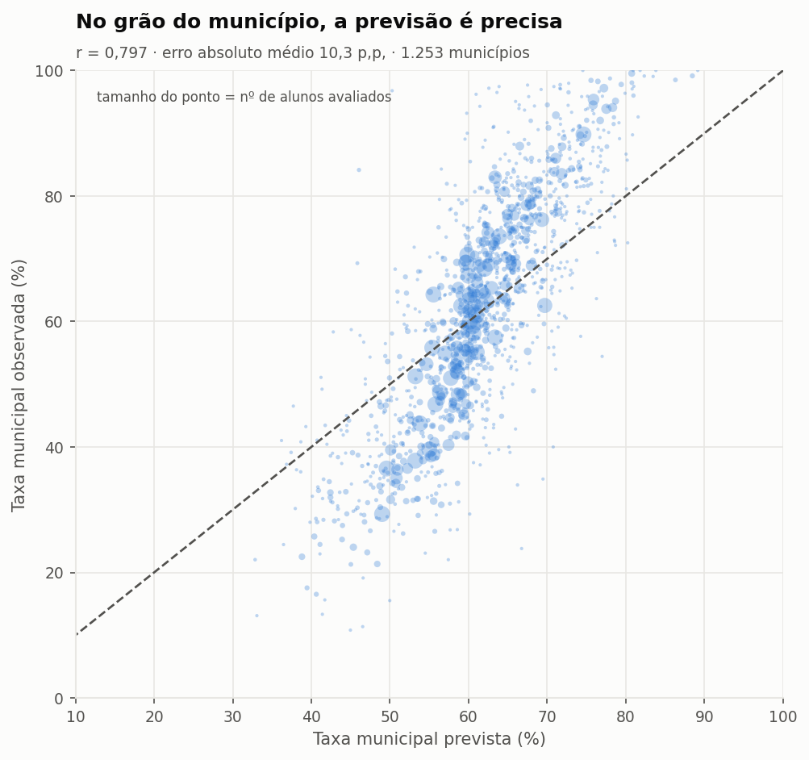
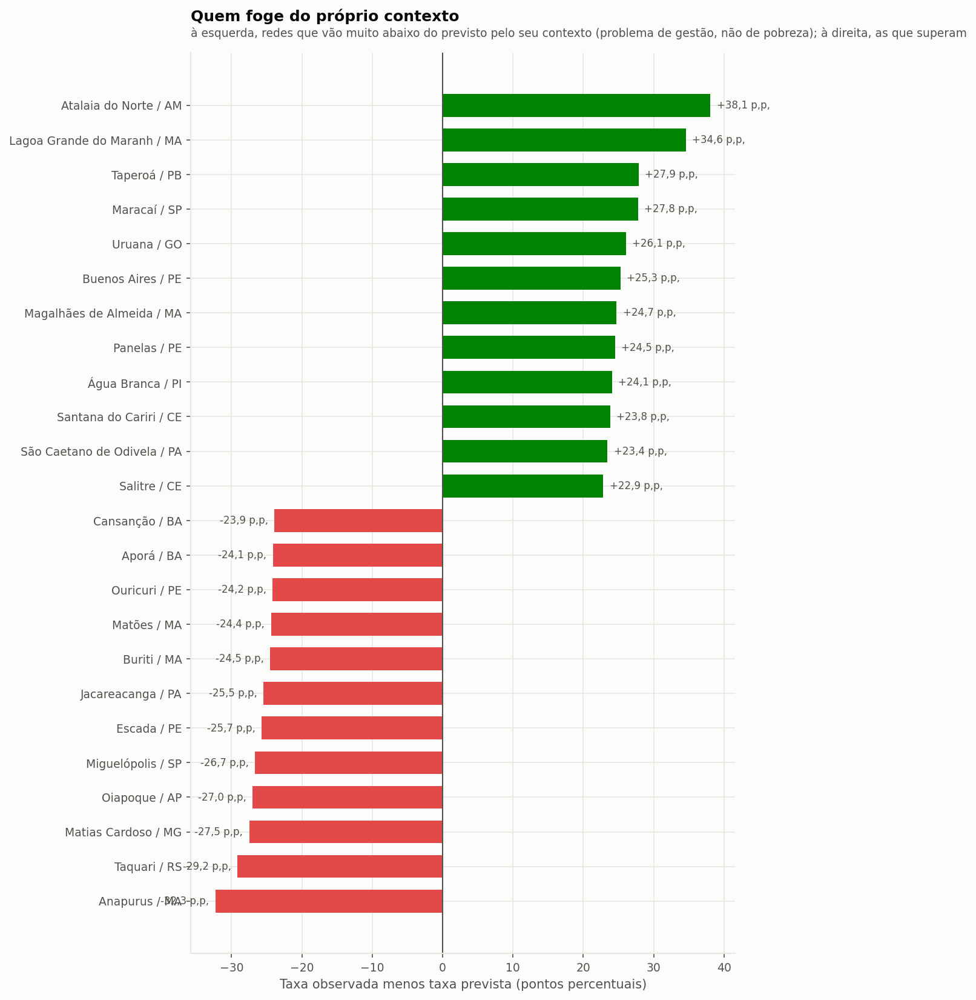
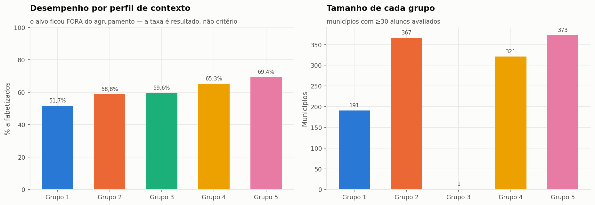

# Aplicação estratégica — desenho `temporal`

## Por que agregar por município muda tudo

A predição individual de alfabetização tem teto baixo: o desfecho de uma criança depende de fatores que nenhum dado público municipal captura. Mas o erro individual em grande parte se **cancela na média** — e é a média municipal que orienta a decisão pública.

| métrica da previsão agregada por município | valor |
|---|---:|
| municípios avaliados (≥30 alunos) | 4.973 |
| correlação prevista × observada | **0,713** |
| erro absoluto médio | **10,6 p.p.** |
| erro mediano | 8,3 p.p. |
| viés | -3,28 p.p. |
| R² | 0,447 |

## Quais municípios apresentam maior risco educacional

Risco = 1 − taxa prevista. Municípios com ao menos 100 alunos avaliados.

| município | UF | alunos | risco previsto | taxa observada |
|---|---|---:|---:|---:|
| Casa Nova | BA | 430 | 81,4% | 20,9% |
| Poço Redondo | SE | 345 | 80,4% | 26,7% |
| Goiatins | TO | 127 | 78,4% | 38,6% |
| Aporá | BA | 230 | 78,1% | 16,5% |
| Entre Rios | BA | 255 | 77,6% | 32,5% |
| Esplanada | BA | 359 | 76,0% | 24,0% |
| Ourolândia | BA | 141 | 76,0% | 34,0% |
| Araci | BA | 331 | 75,4% | 24,5% |
| Porto da Folha | SE | 228 | 75,4% | 17,5% |
| Jussara | BA | 122 | 75,3% | 43,4% |
| Rodelas | BA | 162 | 75,2% | 28,4% |
| Campos Lindos | TO | 148 | 75,2% | 38,5% |
| Pacatuba | SE | 106 | 75,0% | 30,2% |
| Canindé de São Francisco | SE | 460 | 74,9% | 27,0% |
| Canudos | BA | 156 | 74,8% | 30,1% |

## Quem foge dos próprios pares — a leitura acionável

O risco absoluto em geral apenas reflete a pobreza do território. O **resíduo** (observado − previsto) isola o que o contexto NÃO explica.

Mas o resíduo bruto tem um defeito, e ele apareceu na primeira versão desta análise: **confunde gestão municipal com deriva do estado inteiro**. Como o Rio Grande do Sul caiu 18,9 p.p. entre 2023 e 2024, municípios gaúchos ocupavam 4 das 10 piores posições — por um motivo que nada tem a ver com as redes municipais. A coluna reportada aqui é o **resíduo ajustado**: o resíduo menos a mediana do resíduo da própria UF. O que sobra é o desvio do município em relação aos seus pares estaduais.

### Abaixo dos pares estaduais

| município | UF | alunos | observado | previsto | resíduo bruto | ajustado |
|---|---|---:|---:|---:|---:|---:|
| Anapurus | MA | 109 | 33,9% | 82,8% | -48,8 p.p. | **-53,1 p.p.** |
| Uiraúna | PB | 124 | 45,2% | 89,6% | -44,4 p.p. | **-49,3 p.p.** |
| Pirapemas | MA | 103 | 41,7% | 79,2% | -37,4 p.p. | **-41,7 p.p.** |
| Marcação | PB | 129 | 21,7% | 55,8% | -34,1 p.p. | **-39,0 p.p.** |
| Mundo Novo | MS | 239 | 49,0% | 77,5% | -28,5 p.p. | **-38,2 p.p.** |
| Parnarama | MA | 322 | 55,3% | 88,6% | -33,4 p.p. | **-37,6 p.p.** |
| Matões | MA | 269 | 34,2% | 66,4% | -32,2 p.p. | **-36,5 p.p.** |
| Deodápolis | MS | 179 | 66,5% | 92,7% | -26,2 p.p. | **-35,8 p.p.** |
| Urbano Santos | MA | 277 | 39,0% | 70,0% | -31,0 p.p. | **-35,3 p.p.** |
| Nova Xavantina | MT | 245 | 44,9% | 70,0% | -25,1 p.p. | **-33,6 p.p.** |

### Acima dos pares estaduais

| município | UF | alunos | observado | previsto | resíduo bruto | ajustado |
|---|---|---:|---:|---:|---:|---:|
| Tartarugalzinho | AP | 284 | 90,5% | 28,9% | +61,5 p.p. | **+54,3 p.p.** |
| Capinzal do Norte | MA | 101 | 91,1% | 39,4% | +51,6 p.p. | **+47,4 p.p.** |
| Alagoa Nova | PB | 235 | 89,4% | 38,0% | +51,3 p.p. | **+46,5 p.p.** |
| Carlinda | MT | 121 | 99,2% | 45,9% | +53,3 p.p. | **+44,9 p.p.** |
| São João do Arraial | PI | 115 | 87,8% | 39,3% | +48,6 p.p. | **+43,3 p.p.** |
| Atalaia do Norte | AM | 164 | 84,1% | 50,2% | +34,0 p.p. | **+36,5 p.p.** |
| Jequiá da Praia | AL | 115 | 95,7% | 56,4% | +39,3 p.p. | **+34,4 p.p.** |
| Fortaleza dos Nogueiras | MA | 194 | 78,9% | 42,7% | +36,2 p.p. | **+31,9 p.p.** |
| Pio XII | MA | 219 | 63,9% | 27,9% | +36,0 p.p. | **+31,7 p.p.** |
| Magalhães de Almeida | MA | 144 | 81,9% | 47,3% | +34,7 p.p. | **+30,4 p.p.** |

## Quais regiões possuem padrões semelhantes

Agrupamento em 5 perfis por **contexto** (vulnerabilidade, demografia, INSE, docência, infraestrutura, financiamento). O alvo ficou deliberadamente de fora: assim a taxa de alfabetização de cada grupo é um resultado da análise, não o critério que a produziu.

| grupo | municípios | % alfabetizados |
|---|---:|---:|
| 1 | 622 | 52,6% |
| 2 | 1.138 | 57,9% |
| 3 | 763 | 60,5% |
| 4 | 1.370 | 67,6% |
| 5 | 1.080 | 69,9% |

## Quais municípios podem não atingir a meta

A taxa municipal prevista é a média de indicadores de Bernoulli; sua distribuição amostral é aproximadamente normal, e a probabilidade de ficar abaixo da meta é Φ((meta − previsto) / erro-padrão).

| classificação | municípios |
|---|---:|
| provável cumprimento | 351 |
| atenção | 199 |
| risco alto | 418 |
| risco crítico | 1.502 |

As 15 maiores lacunas entre a taxa prevista e a meta pactuada (municípios com ≥100 alunos avaliados):

| município | UF | alunos | meta | taxa prevista | lacuna | prob. de não atingir |
|---|---|---:|---:|---:|---:|---:|
| Senador Amaral | MG | 116 | 71,8% | 52,7% | **-19,0 p.p.** | 100,0% |
| Ferreira Gomes | AP | 150 | 74,4% | 57,4% | **-17,1 p.p.** | 100,0% |
| Imaculada | PB | 100 | 69,2% | 53,1% | **-16,1 p.p.** | 99,9% |
| Ji-Paraná | RO | 1.481 | 80,0% | 64,8% | **-15,2 p.p.** | 100,0% |
| Marcação | PB | 129 | 70,7% | 55,8% | **-14,9 p.p.** | 100,0% |
| Itinga | MG | 108 | 56,8% | 42,3% | **-14,6 p.p.** | 99,9% |
| Madeiro | PI | 102 | 65,0% | 50,6% | **-14,4 p.p.** | 99,8% |
| Sangão | SC | 157 | 71,0% | 56,9% | **-14,1 p.p.** | 100,0% |
| Rio Tinto | PB | 231 | 78,2% | 64,2% | **-14,0 p.p.** | 100,0% |
| Nina Rodrigues | MA | 128 | 57,5% | 43,9% | **-13,6 p.p.** | 99,9% |
| Juripiranga | PB | 110 | 55,3% | 41,7% | **-13,5 p.p.** | 99,8% |
| Pedra Branca do Amapari | AP | 184 | 68,5% | 55,0% | **-13,5 p.p.** | 100,0% |
| Porto Grande | AP | 337 | 67,6% | 54,2% | **-13,4 p.p.** | 100,0% |
| Indiaroba | SE | 235 | 44,8% | 31,4% | **-13,4 p.p.** | 100,0% |
| Maracanã | PA | 197 | 70,0% | 57,0% | **-13,0 p.p.** | 100,0% |

> **Ressalva estatística.** O cálculo supõe independência condicional entre alunos. Como colegas de escola compartilham choques não observados, o erro-padrão real é maior e estas probabilidades são mais extremas do que deveriam — em municípios grandes elas saturam em 100%, o que torna a própria probabilidade inútil para ordenar. Por isso a tabela é ordenada pela **lacuna em pontos percentuais**, que não satura. A ordenação é confiável; a magnitude da probabilidade, não.