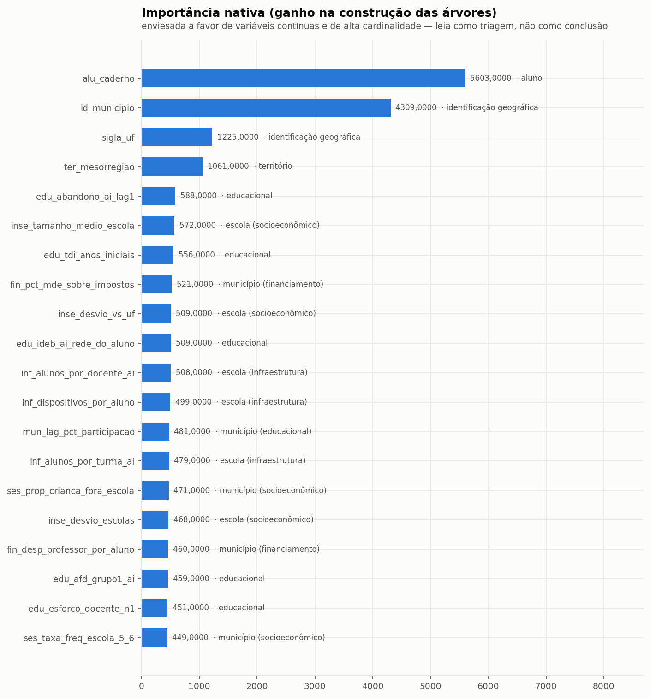
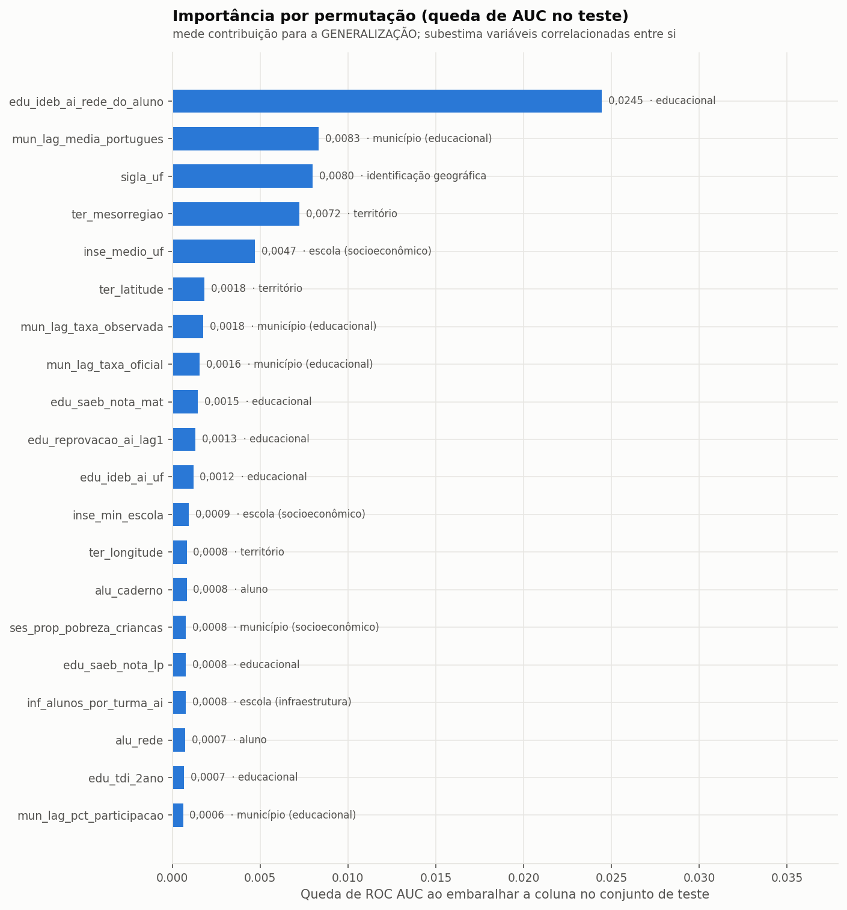
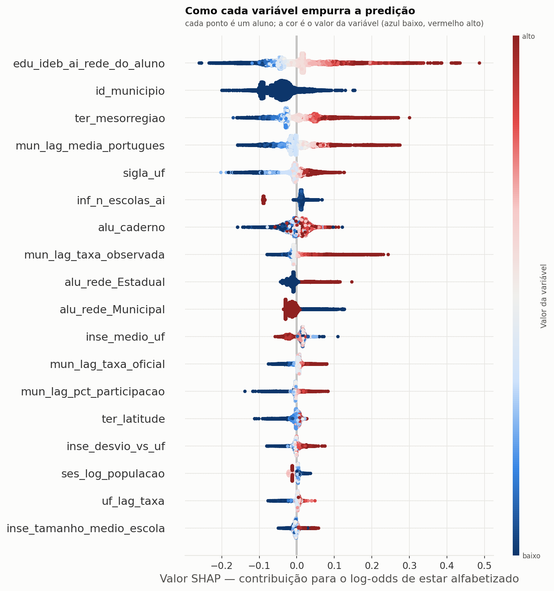

# Interpretabilidade — desenho `espacial`

Modelo: **LGBMClassifier** · 137 features.

Quatro leituras, propositalmente diferentes. Quando elas discordam, a discordância é informação: importância nativa alta com permutação baixa indica variável que o modelo usou para ajustar ruído.

## 1. Importância nativa (ganho)

| feature | bloco | importancia |
|---|---|---|
| `alu_caderno` | aluno | 5603 |
| `id_municipio` | identificação geográfica | 4309 |
| `sigla_uf` | identificação geográfica | 1225 |
| `ter_mesorregiao` | território | 1061 |
| `edu_abandono_ai_lag1` | educacional | 588 |
| `inse_tamanho_medio_escola` | escola (socioeconômico) | 572 |
| `edu_tdi_anos_iniciais` | educacional | 556 |
| `fin_pct_mde_sobre_impostos` | município (financiamento) | 521 |
| `inse_desvio_vs_uf` | escola (socioeconômico) | 509 |
| `edu_ideb_ai_rede_do_aluno` | educacional | 509 |
| `inf_alunos_por_docente_ai` | escola (infraestrutura) | 508 |
| `inf_dispositivos_por_aluno` | escola (infraestrutura) | 499 |
| `mun_lag_pct_participacao` | município (educacional) | 481 |
| `inf_alunos_por_turma_ai` | escola (infraestrutura) | 479 |
| `ses_prop_crianca_fora_escola` | município (socioeconômico) | 471 |

## 2. Importância por permutação (queda de AUC no teste)

A medida honesta: quanto a generalização piora ao embaralhar a coluna.

| feature | bloco | queda_auc | desvio |
|---|---|---|---|
| `edu_ideb_ai_rede_do_aluno` | educacional | 0,02445 | 0,00091 |
| `mun_lag_media_portugues` | município (educacional) | 0,00834 | 0,00031 |
| `sigla_uf` | identificação geográfica | 0,00799 | 0,00016 |
| `ter_mesorregiao` | território | 0,00724 | 0,00046 |
| `inse_medio_uf` | escola (socioeconômico) | 0,00471 | 0,00007 |
| `ter_latitude` | território | 0,00183 | 0,00009 |
| `mun_lag_taxa_observada` | município (educacional) | 0,00177 | 0,00028 |
| `mun_lag_taxa_oficial` | município (educacional) | 0,00156 | 0,00023 |
| `edu_saeb_nota_mat` | educacional | 0,00146 | 0,00005 |
| `edu_reprovacao_ai_lag1` | educacional | 0,00133 | 0,00003 |
| `edu_ideb_ai_uf` | educacional | 0,00121 | 0,00004 |
| `inse_min_escola` | escola (socioeconômico) | 0,00094 | 0,00012 |
| `ter_longitude` | território | 0,00083 | 0,00009 |
| `alu_caderno` | aluno | 0,00082 | 0,00050 |
| `ses_prop_pobreza_criancas` | município (socioeconômico) | 0,00078 | 0,00003 |

## 3. SHAP

Decomposição aditiva de cada predição individual.

| feature | shap_medio_abs |
|---|---|
| `edu_ideb_ai_rede_do_aluno` | 0,06259 |
| `id_municipio` | 0,04862 |
| `ter_mesorregiao` | 0,04506 |
| `mun_lag_media_portugues` | 0,03369 |
| `sigla_uf` | 0,02659 |
| `inf_n_escolas_ai` | 0,02041 |
| `alu_caderno` | 0,01934 |
| `mun_lag_taxa_observada` | 0,01834 |
| `alu_rede_Estadual` | 0,01721 |
| `alu_rede_Municipal` | 0,01693 |
| `inse_medio_uf` | 0,01687 |
| `mun_lag_taxa_oficial` | 0,01021 |
| `mun_lag_pct_participacao` | 0,00782 |
| `ter_latitude` | 0,00744 |
| `inse_desvio_vs_uf` | 0,00675 |

## 4. Ablação por bloco

Remove um bloco temático inteiro e mede a perda. É a leitura que sobrevive à multicolinearidade.

| bloco | n_features | roc_auc | queda_auc |
|---|---|---|---|
| sem município (educacional) | 128 | 0,64248 | 0,00876 |
| sem educacional | 106 | 0,64779 | 0,00345 |
| sem escola (socioeconômico) | 127 | 0,64860 | 0,00264 |
| sem UF | 135 | 0,64942 | 0,00183 |
| sem município (socioeconômico) | 99 | 0,64945 | 0,00179 |
| sem aluno | 135 | 0,65028 | 0,00096 |
| sem município (financiamento) | 122 | 0,65044 | 0,00080 |
| (modelo completo) | 137 | 0,65124 | 0,00000 |
| sem território | 131 | 0,65346 | -0,00222 |
| sem escola (infraestrutura) | 115 | 0,65597 | -0,00473 |
| sem identificação geográfica | 135 | 0,65671 | -0,00546 |

