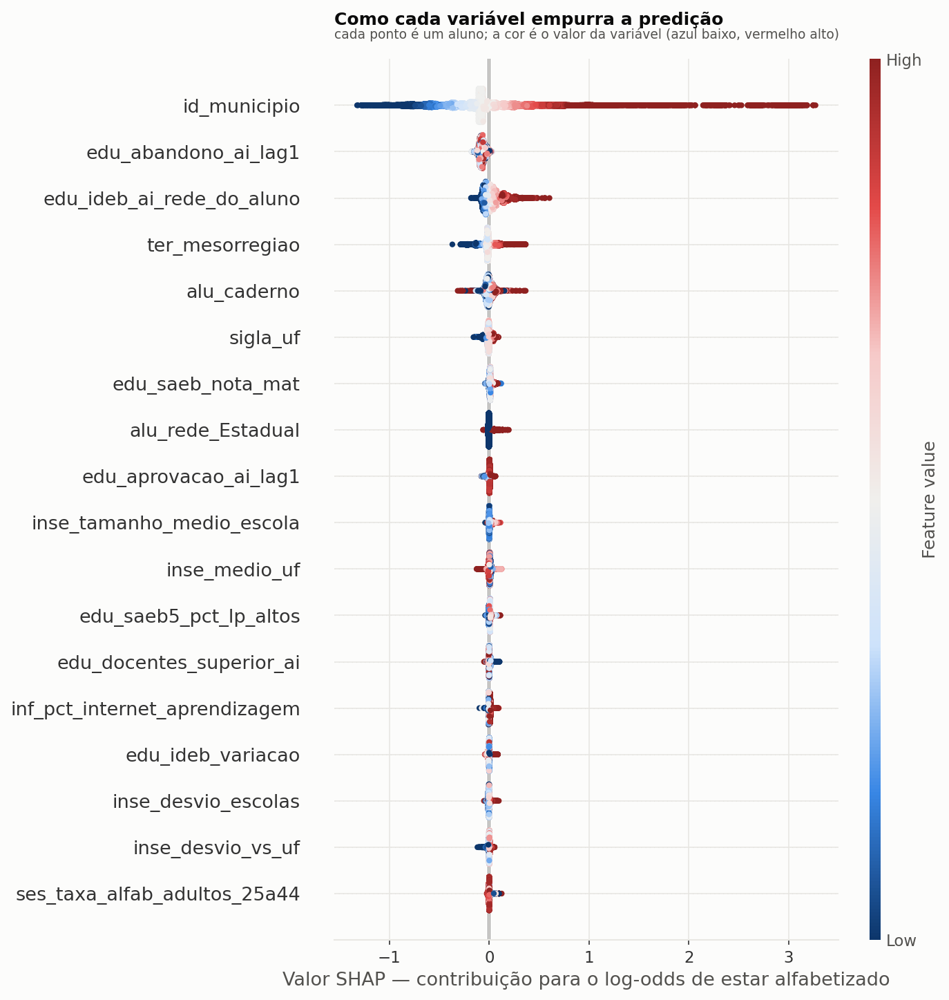

# Interpretabilidade — desenho `temporal`

Modelo: **LGBMClassifier** · 125 features.

Quatro leituras, propositalmente diferentes. Quando elas discordam, a discordância é informação: importância nativa alta com permutação baixa indica variável que o modelo usou para ajustar ruído.

## 1. Importância nativa (ganho)

| feature | bloco | importancia |
|---|---|---|
| `alu_caderno` | aluno | 6274 |
| `id_municipio` | identificação geográfica | 3878 |
| `sigla_uf` | identificação geográfica | 1049 |
| `ter_mesorregiao` | território | 987 |
| `inse_tamanho_medio_escola` | escola (socioeconômico) | 557 |
| `inf_dispositivos_por_aluno` | escola (infraestrutura) | 547 |
| `inf_alunos_por_docente_ai` | escola (infraestrutura) | 529 |
| `fin_desp_professor_por_aluno` | município (financiamento) | 523 |
| `fin_pct_mde_sobre_impostos` | município (financiamento) | 504 |
| `inf_alunos_por_turma_ai` | escola (infraestrutura) | 502 |
| `inf_pct_tempo_integral_ai` | escola (infraestrutura) | 495 |
| `ses_prop_crianca_fora_escola` | município (socioeconômico) | 489 |
| `inse_desvio_escolas` | escola (socioeconômico) | 489 |
| `edu_tdi_anos_iniciais` | educacional | 487 |
| `ses_share_indigena_quilombola` | município (socioeconômico) | 478 |

## 2. Importância por permutação (queda de AUC no teste)

A medida honesta: quanto a generalização piora ao embaralhar a coluna.

| feature | bloco | queda_auc | desvio |
|---|---|---|---|
| `id_municipio` | identificação geográfica | 0,05998 | 0,00074 |
| `edu_ideb_ai_rede_do_aluno` | educacional | 0,01511 | 0,00035 |
| `ter_mesorregiao` | território | 0,00260 | 0,00010 |
| `alu_rede` | aluno | 0,00093 | 0,00018 |
| `edu_tdi_2ano` | educacional | 0,00085 | 0,00006 |
| `inf_pct_lab_informatica` | escola (infraestrutura) | 0,00059 | 0,00004 |
| `edu_saeb5_pct_lp_altos` | educacional | 0,00052 | 0,00004 |
| `inse_desvio_escolas` | escola (socioeconômico) | 0,00047 | 0,00004 |
| `edu_saeb_nota_mat` | educacional | 0,00047 | 0,00024 |
| `fin_invest_aluno_ens_fund` | município (financiamento) | 0,00044 | 0,00006 |
| `fin_pct_fundeb_educ_infantil` | município (financiamento) | 0,00044 | 0,00002 |
| `edu_alunos_por_turma_ai` | educacional | 0,00044 | 0,00007 |
| `inse_desvio_vs_uf` | escola (socioeconômico) | 0,00040 | 0,00007 |
| `inse_tamanho_medio_escola` | escola (socioeconômico) | 0,00038 | 0,00010 |
| `ses_prop_resp_sem_fundamental` | município (socioeconômico) | 0,00036 | 0,00005 |

## 3. SHAP

Decomposição aditiva de cada predição individual.

| feature | shap_medio_abs |
|---|---|
| `id_municipio` | 0,34741 |
| `edu_abandono_ai_lag1` | 0,06901 |
| `edu_ideb_ai_rede_do_aluno` | 0,06858 |
| `ter_mesorregiao` | 0,05422 |
| `alu_caderno` | 0,02716 |
| `sigla_uf` | 0,02106 |
| `edu_saeb_nota_mat` | 0,01454 |
| `alu_rede_Estadual` | 0,00999 |
| `edu_aprovacao_ai_lag1` | 0,00967 |
| `inse_tamanho_medio_escola` | 0,00942 |
| `inse_medio_uf` | 0,00884 |
| `edu_saeb5_pct_lp_altos` | 0,00797 |
| `edu_docentes_superior_ai` | 0,00686 |
| `inf_pct_internet_aprendizagem` | 0,00677 |
| `edu_ideb_variacao` | 0,00646 |

## 4. Ablação por bloco

Remove um bloco temático inteiro e mede a perda. É a leitura que sobrevive à multicolinearidade.

| bloco | n_features | roc_auc | queda_auc |
|---|---|---|---|
| sem município (socioeconômico) | 87 | 0,63224 | 0,00151 |
| sem educacional | 94 | 0,63248 | 0,00127 |
| sem escola (socioeconômico) | 115 | 0,63255 | 0,00120 |
| sem identificação geográfica | 123 | 0,63273 | 0,00103 |
| sem escola (infraestrutura) | 103 | 0,63359 | 0,00016 |
| (modelo completo) | 125 | 0,63376 | 0,00000 |
| sem território | 119 | 0,63388 | -0,00012 |
| sem aluno | 123 | 0,63409 | -0,00033 |
| sem município (financiamento) | 111 | 0,63410 | -0,00035 |

